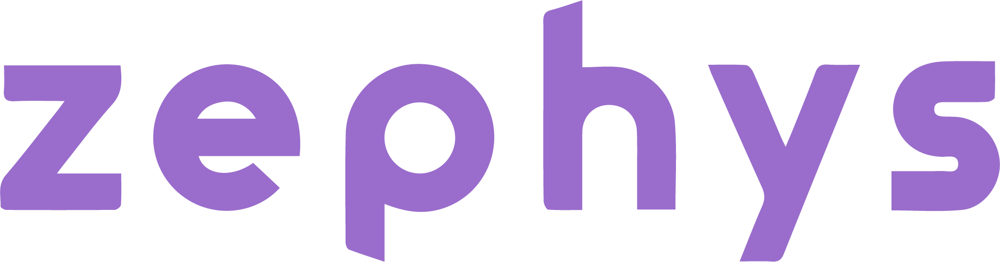

# Zephys
Zephys is a fictitious company created to build the project for the reactjs course of [Coderhouse](https://www.coderhouse.com).

  - [Demo](#demo)
  - [Installation](#installation)
  - [Features](#features)
  - [Dependencies](#dependencies)
  - [Contact](#contact)

## <a name="demo"></a>Demo
<a target="__blank" href="https://zephys.vercel.app/">Take a look at the project</a>

## <a name="installation"></a>Installation
This project requires NodeJS to work.

First of all you have to clone the project then enter to the project directory after that install dependencies and finally start the server.
```bash
  git clone https://github.com/AgustinGomezDev/zephys.git
  cd zephys
  npm install
  npm run dev
```
## <a name="features"></a>Features
  - Persistent shopping cart
  - Customers cannot buy more products than are in stock
  - Products divided into categories
  - Form validation
  - Products and orders stored in a database

## <a name="dependencies"></a>Dependencies
- Project dependencies
  - <a target="__blank" href="https://react-icons.github.io/react-icons">React Icons</a>
  - <a target="__blank" href="https://reactrouter.com/en/main">React Router Dom</a>
  - <a target="__blank" href="https://fkhadra.github.io/react-toastify/introduction">React Toastify</a>
  - <a target="__blank" href="https://firebase.google.com">Firebase</a>
  - <a target="__blank" href="https://formik.org/">Formik</a>
  - <a target="__blank" href="https://github.com/jquense/yup">Yup</a>
- Dev dependencies
  - <a target="__blank" href="https://vitejs.dev/">Vite</a>
  - <a target="__blank" href="https://tailwindcss.com/">Tailwindcss</a>

## <a name="contact"></a>Contact
You can reach me at agustingomezdev@gmail.com or <a href="https://www.linkedin.com/in/agustingomezdev/">LinekdIn</a>.


